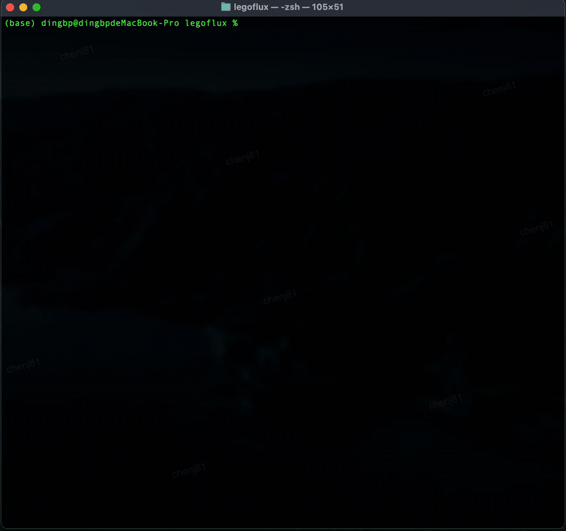

# LegoFlux


> *"The coding agent scaffold that fits in your head — complete enough to use, simple enough to own."*

A **fully-featured coding agent in ~2,200 lines of Python** — read, edit, execute, search, and browse the web, with context compression and workspace sandboxing built in.

- **Complete agent, zero magic** — 9 tools, session persistence, streaming, context management. All in readable Python you can audit in an afternoon.
- **Cost-aware context** — Hysteresis-based compression keeps you inside the token budget automatically; API-calibrated counting means no surprise overflows.
- **Drop-a-`.py` plugins** — Adding a tool is one file (`DEFINITION` + `execute()`) and one line in `config.yaml`. No framework to learn.

<p>
  
  
</p>

---

## Quick Start

```bash
pip install -r requirements.txt     # install dependancies
vim config.yaml                     # fill your API key/base_url
python agent.py                     # start the coding agent
```

> **Tip:** `python chat.py` launches a minimal streaming chat (no tools) for quick Q&A.

---

## Why LegoFlux?

Most open-source agents are either **toy demos** that fall apart on real tasks, or **sprawling frameworks** that need a week to understand.

LegoFlux occupies the middle ground on purpose:

- **Constraints as features.** Single-file entry point, flat tool directory, YAML-only config. You can `grep -r` the entire project and get answers.
- **Own the code.** No plugin SDK, no abstract base classes, no dependency injection. Fork it, change it, ship it.
- **Production patterns included.** Retry with backoff, workspace sandboxing, bash safety checks, context compression — the boring stuff that matters is already here.

---

## Features

| Feature | What it does for you |
|---|---|
| **9 Built-in Tools** | Read, list, find, edit, write, bash, code_search, web_search, web_fetch |
| **Streaming Output** | See tokens as they arrive, not after a long wait |
| **Session Persistence** | Pick up where you left off — JSONL sessions with `/session`, `/session use`, `/session new` |
| **Cost-Aware Context** | LLM-powered compression with hysteresis trigger; API-calibrated token counting |
| **Workspace Sandbox** | File access restricted to the project directory — no accidental writes outside |
| **Bash Safety** | Dangerous commands blocked by default; explicit confirmation required |
| **Drop-in Plugins** | One `.py` file + one config line = new tool |
| **Multi-Model Profiles** | Define multiple models in YAML, hot-switch with `/model use <profile>` |
| **Retry with Backoff** | Automatic retries on timeout, rate limit, and server errors |

---

## Architecture

```
┌──────────────────────────────────────────────────────────────────┐
│  agent.py                                                        │
│                                                                  │
│  ┌──────────┐   ┌────────────────────────────────────────────┐   │
│  │  User    │   │  Agent Loop                                │   │
│  │  Input   │──>│                                            │   │
│  │          │   │  1. Slash commands (/session /model /...)  │   │
│  │          │   │  2. Append user message to session         │   │
│  │          │   │  3. Check context → compress if needed     │   │
│  │          │   │  4. Stream LLM response                    │   │
│  │          │<──│  5. Execute tool calls → loop until done   │   │
│  └──────────┘   └──────┬──────────────┬──────────────┬───────┘   │
│                        │              │              │           │
│     ┌──────────────────▼──┐   ┌───────▼────────┐ ┌──—▼─────────┐ │
│     │  Tool Layer         │   │  Context Mgr   │ │  Session    │ │
│     │  (tools/*.py)       │   │  (core/)       │ │  (core/)    │ │
│     │                     │   │                │ │             │ │
│     │  read  list  find   │   │  Token count   │ │  JSONL      │ │
│     │  edit  write bash   │   │  LLM compress  │ │  /session   │ │
│     │  code_search        │   │  Calibration   │ │  /model     │ │
│     │  web_search/fetch   │   │                │ │             │ │
│     └──────────┬──────────┘   └────────────────┘ └─────────────┘ │
│                │                                                 │
│     ┌──────────▼──────────┐                                      │
│     │  Sandbox            │  Path resolution + workspace fence   │
│     └─────────────────────┘                                      │
└──────────────────────────────────────────────────────────────────┘
```

---

## Usage Examples

### Read & understand a codebase

```bash
      You: Find all Python files in this project and tell me what each one does.

     Tool: [find({'pattern': '**/*.py', 'path': '.', 'limit': 200})]
  ✓ Done (0.0s)
  [tokens] prompt: 1,387, completion: 100, total: 1,487

     Tool: [read({'path': 'agent.py', 'mode': 'full', 'offset': 1, 'limit': 400})]
  ✓ Done (0.0s)
  [tokens] prompt: 4,365, completion: 30, total: 4,395

     Tool: [read({'path': 'agent.py', 'mode': 'full', 'offset': 401, 'limit': 400})]
  ✓ Done (0.0s)
  [tokens] prompt: 5,435, completion: 30, total: 5,465

     Tool: [read({'path': 'chat.py', 'mode': 'full', 'offset': 1, 'limit': 400})]
  ✓ Done (0.0s)
  [tokens] prompt: 6,278, completion: 33, total: 6,311

     Tool: [read({'path': 'core/__init__.py', 'mode': 'full', 'offset': 1, 'limit': 400})]
  ✓ Done (0.0s)
  [tokens] prompt: 6,331, completion: 31, total: 6,362

     Tool: [read({'path': 'core/context.py', 'mode': 'full', 'offset': 1, 'limit': 400})]
  ✓ Done (0.0s)
  [tokens] prompt: 9,566, completion: 32, total: 9,598

     Tool: [read({'path': 'core/error_codes.py', 'mode': 'full', 'offset': 1, 'limit': 400})]
  ✓ Done (0.0s)
  [tokens] prompt: 9,835, completion: 32, total: 9,867

     Tool: [read({'path': 'core/model_runtime.py', 'mode': 'full', 'offset': 1, 'limit': 400})]
  ✓ Done (0.0s)
  [tokens] prompt: 11,304, completion: 32, total: 11,336

     Tool: [read({'path': 'core/sandbox.py', 'mode': 'full', 'offset': 1, 'limit': 400})]
  ✓ Done (0.0s)
  [tokens] prompt: 13,494, completion: 32, total: 13,526

     Tool: [read({'path': 'core/tool_result.py', 'mode': 'full', 'offset': 1, 'limit': 400})]
  ✓ Done (0.0s)
  [tokens] prompt: 14,035, completion: 31, total: 14,066

     Tool: [read({'path': 'core/utils.py', 'mode': 'full', 'offset': 1, 'limit': 400})]
  ✓ Done (0.0s)
  [tokens] prompt: 17,282, completion: 33, total: 17,315

     Tool: [read({'path': 'tools/__init__.py', 'mode': 'full', 'offset': 1, 'limit': 400})]
  ✓ Done (0.0s)
  [tokens] prompt: 18,053, completion: 31, total: 18,084

     Tool: [read({'path': 'tools/bash.py', 'mode': 'full', 'offset': 1, 'limit': 400})]
  ✓ Done (0.0s)
  [tokens] prompt: 19,658, completion: 32, total: 19,690

     Tool: [read({'path': 'tools/code_search.py', 'mode': 'full', 'offset': 1, 'limit': 400})]
  ✓ Done (0.0s)
  [tokens] prompt: 20,912, completion: 31, total: 20,943

     Tool: [read({'path': 'tools/edit.py', 'mode': 'full', 'offset': 1, 'limit': 400})]
  ✓ Done (0.0s)
  [tokens] prompt: 21,936, completion: 31, total: 21,967

     Tool: [read({'path': 'tools/find.py', 'mode': 'full', 'offset': 1, 'limit': 400})]
  ✓ Done (0.0s)
  [tokens] prompt: 22,950, completion: 31, total: 22,981

     Tool: [read({'path': 'tools/list.py', 'mode': 'full', 'offset': 1, 'limit': 400})]
  ✓ Done (0.0s)
  [tokens] prompt: 23,731, completion: 31, total: 23,762

     Tool: [read({'path': 'tools/read.py', 'mode': 'full', 'offset': 1, 'limit': 400})]
  ✓ Done (0.0s)
  [tokens] prompt: 25,455, completion: 32, total: 25,487

     Tool: [read({'path': 'tools/web_fetch.py', 'mode': 'full', 'offset': 1, 'limit': 400})]
  ✓ Done (0.0s)
  [tokens] prompt: 26,740, completion: 32, total: 26,772

     Tool: [read({'path': 'tools/web_search.py', 'mode': 'full', 'offset': 1, 'limit': 400})]
  ✓ Done (0.0s)
  [tokens] prompt: 27,848, completion: 31, total: 27,879

     Tool: [read({'path': 'tools/write.py', 'mode': 'full', 'offset': 1, 'limit': 400})]
  ✓ Done (0.0s)

Assistant: Here’s what each Python file in this project does:
           
           - agent.py
             - The main coding agent runtime. Streams LLM responses, handles tool calls, and manages an interactive loop with sessions and context compression. Supports slash commands (/session, /status, /compact, /model), enforces tool iteration limits, truncates large tool outputs, and implements retry/backoff for LLM errors. Bootstraps tools, model runtime, session, and optional context manager.
           
           - chat.py
             - A minimal “basic chat” agent (Version 1). Streams replies from the configured model without tools or context compression. Uses the same session/history mechanism as the main agent.
           
           - core/__init__.py
             - Empty module initializer for the core package.
           
           - core/context.py
             - Context management and compression. Estimates token usage (messages + tool calls), and when thresholds are exceeded, summarizes older conversation into a structured “memory” object using the LLM. Defines memory schema (completed, pending, decisions, files_modified, recent_errors, open_issues), validates and enforces limits, and replaces older messages with a compact memory system message while keeping recent rounds. Uses tiktoken for token counting and includes retry logic for the summarization call.
           
           - core/error_codes.py
             - Centralized string constants for error codes used by tools and runtime (e.g., INVALID_ARGS, NOT_FOUND, TIMEOUT, SANDBOX_BLOCKED).
           
           - core/model_runtime.py
             - Model/profile management for OpenAI-compatible backends. Loads profiles from config, validates API keys/base URLs, builds an OpenAI client, and exposes a switchable ModelState (model, base_url, client, token/timeouts, retry policy).
           
           - core/sandbox.py
             - Workspace sandbox utilities. Resolves and validates paths confined to a configured root, and validates bash commands to block dangerous patterns (e.g., second-stage interpreters, command substitution, parent traversal, home access, absolute paths outside workspace). Provides helpers to resolve files/dirs with structured error results.
           
           - core/tool_result.py
             - Structured return type for tools (ToolResult) including ok/content/error_code/message/meta. Utility for wrapping exceptions and formatting limited output with truncation notices.
           
           - core/utils.py
             - Project utilities: loads config.yaml with env-var resolution, safe nested get_cfg, retryable error detection, atomic file writes, system prompt builder (with tool usage/workflow/safety guidelines), session management (JSONL store with resume/replace), and an interactive input reader with prompt_toolkit history and multiline support.
           
           - tools/__init__.py
             - Tool registry and dispatcher. Auto-discovers tool modules by name, returns OpenAI “function” definitions, and routes tool calls to execute(). Validates return types and reports unknown tools.
           
           - tools/bash.py
             - Runs bash commands inside the workspace sandbox with a minimal environment, timeout, and safe-mode prompt for dangerous commands (TTY confirmation). Returns stdout/stderr and exit code; handles timeouts and execution errors.
           
           - tools/code_search.py
             - Searches code using ripgrep (rg). Supports regex, glob filters, case-insensitive mode, and result limits. Returns matching lines with file paths and line numbers. Handles missing rg and timeouts gracefully.
           
           - tools/edit.py
             - Atomic in-place text replacement in a file: replaces old_str with new_str exactly once (enforces uniqueness), writes changes atomically, and returns a unified diff. Validates permissions and arguments.
           
           - tools/find.py
             - Glob-based recursive file search constrained to the workspace. Skips common directories (.git, __pycache__, node_modules, .venv, .devenv), returns relative paths, and supports result limits with truncation notices.
           
           - tools/list.py
             - Lists one level of directory contents (files vs directories with “/” suffix), sorted case-insensitively. Respects sandbox and supports result limits.
           
           - tools/read.py
             - Reads text files with line numbers, offset/limit pagination, and a “structure” mode that shows only structural lines (imports, defs, classes, control flow, decorators). Detects binary/non-UTF-8 files and returns clear errors or guidance.
           
           - tools/web_fetch.py
             - Fetches and returns webpage content as markdown via an external API (Aliyun IQS readpage). Requires iqs_api_key in config.yaml. Supports max_chars and offset pagination in the returned content.
           
           - tools/web_search.py
             - Web search via an external API (Aliyun IQS unified search). Requires iqs_api_key. Returns titles, URLs, and snippets for a given query with configurable result count and time range.
           
           - tools/write.py
             - Creates or overwrites files atomically within the workspace. Auto-creates parent directories, reports whether a file was created vs updated, and provides basic metadata (chars written). Handles permissions and execution errors.
  [tokens] prompt: 28,480, completion: 1,908, total: 30,388
```

### Skim large files by structure first

```bash
      You: Show me the high-level structure of agent.py.

     Tool: [read({'path': '/Users/dingbp/XPeng-RL/legoflux/agent.py', 'mode': 'structure', 'offset': 1, 'limit': 500})]
  ✓ Done (0.0s)
  [tokens] prompt: 2,763, completion: 308, total: 3,071

     Tool: [read({'path': '/Users/dingbp/XPeng-RL/legoflux/agent.py', 'mode': 'full', 'offset': 1, 'limit': 1000})]
  ✓ Done (0.0s)

Assistant: High-level outline of agent.py:
           
           - Module header and imports
             - Docstring, stdlib imports (json, os, time, dataclasses)
             - Project imports: core.error_codes, core.utils (config/session helpers, labels, UserInputReader, retry check), tools (get_tools, process_tool_call), core.context.ContextManager, core.model_runtime.ModelRuntime, core.tool_result.ToolResult
           
           - AgentConfig (dataclass)
             - Fields: max_tool_iterations, max_tool_result_chars, context_enabled, verbose
             - from_cfg(cls, cfg): builds AgentConfig from app config
           
           - Agent class
             - __init__(...): wires model_runtime, config, session, tools, context_manager, input_reader, caller_file, system_prompt; registers slash-command handlers
             - Session management helpers:
               - _current_session_id()
               - _cmd_list_sessions(): list saved sessions, mark current
               - _switch_session(session_file, session_id): swap session and update context memory
               - _cmd_resume_session(session_id)
               - _cmd_new_session()
             - Status and model helpers:
               - _cmd_status(): print runtime, session, cwd; context token usage if enabled
               - _cmd_model(arg): list/use model profiles via ModelRuntime
             - Slash-command plumbing:
               - _available_slash_commands_line(): build help string for unknown commands
               - _print_unknown_slash_command(raw_input)
               - _has_unexpected_args(args) [@staticmethod]
               - _handle_slash_session(args): “/session” (list/new/use)
               - _handle_slash_status(args): “/status”
               - _handle_slash_compact(args): “/compact” (toggle/behavior via ContextManager)
               - _handle_slash_model(args): “/model” (list/use)
               - _try_handle_slash_command(user_input): parse and dispatch “/...” commands
             - Inference and tool execution:
               - _run_inference_once(state): consume streaming model output, print assistant content, accumulate function-call deltas, return usage and assembled tool_calls
               - run_inference(): retry loop around _run_inference_once for transient LLM errors
               - run(): interactive REPL loop
                 - read input (UserInputReader), handle slash commands
                 - manage context compaction if enabled
                 - call model, process function/tool calls in iterations (up to max_tool_iterations)
                 - for each tool call: parse args JSON, execute with process_tool_call, handle errors, truncate long results, append tool results to session
                 - handle KeyboardInterrupt during tool execution
           
           - main()
             - Load config; determine enabled tools; build system prompt
             - Create AgentConfig and ModelRuntime
             - Create new Session; optionally initialize ContextManager and restore memory
             - Create UserInputReader; instantiate Agent and run()
           
           - if __name__ == "__main__": main()
  [tokens] prompt: 5,674, completion: 1,129, total: 6,803
```

---

## Slash Commands

| Command | Description |
|---|---|
| `/session` | List available sessions and mark the current one |
| `/session use <id>` | Switch to an existing session |
| `/session new` | Create and switch to a new session |
| `/model` | List all model profiles and mark the active one |
| `/model use <profile>` | Hot-switch model profile in current session |
| `/status` | Show model, directory, session, and context status |
| `/compact` | Force context compression |

---

## Configuration

Core settings in `config.yaml`:

```yaml
model:
  provider: openai_compatible
  active: gpt5                          # active model profile
  max_completion_tokens: 8192           # shared defaults for all profiles
  max_retries: 2
  retry_backoff_sec: 1.0
  timeout_sec: 120
  profiles:
    gpt5:
      name: gpt-5
      api_key: ${OPENAI_API_KEY}        # env vars resolved automatically
      base_url: https://api.openai.com/v1/

context:
  compress_trigger_tokens: 90000        # auto-compress above this

tools:
  - read
  - list
  - bash
  - edit
  - write
  - find
  - code_search
  - web_search
  - web_fetch
```

`read` supports `mode`:

- `mode: "full"` (default): return full file lines with line numbers
- `mode: "structure"`: return structural lines only (imports, class/def, decorators, and control headers)

> See [`config.yaml`](config.yaml) for the full reference with all options.

---

## Project Structure

```
legoflux/
├── agent.py              # Main coding agent (entry point)
├── chat.py               # Minimal streaming chat (no tools)
├── config.yaml           # All configuration in one file
├── core/
│   ├── utils.py          # Config, session, system prompt
│   ├── context.py        # Token counting, LLM compression
│   ├── model_runtime.py  # Model profile hot-switching
│   └── sandbox.py        # Workspace path sandboxing
├── tools/                # One file per tool
│   ├── read.py  list.py  find.py  edit.py  write.py
│   ├── bash.py  code_search.py
│   └── web_search.py  web_fetch.py
└── sessions/             # Auto-created session storage
```

---

## Requirements

- Python 3.8+
- [ripgrep](https://github.com/BurntSushi/ripgrep) (`brew install ripgrep`) — for `code_search`
- An OpenAI-compatible API endpoint

---

## Contributing

Contributions are welcome! Fork the repo, make your changes, and open a PR.

## License

MIT
